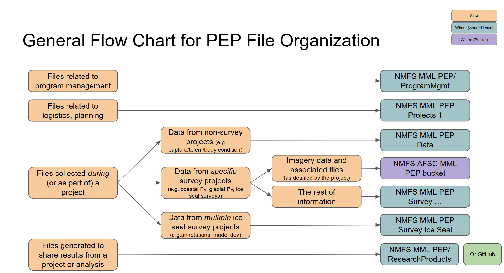
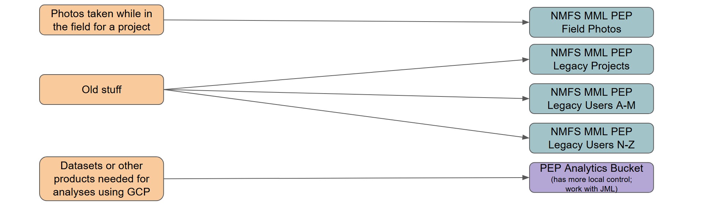

# PEP Data Storage

This section details what PEP information is stored where within the cloud. See [PEP Onboarding](pep_onboarding.qmd) for more information about how to work with data in these various locations.

## Individual Storage

The two options available for storing individual files (such as administrative documentation, working copies of files, etc.) are your **laptop** or individual **Google Drive** ("My Drive"). No original or processed data should be stored exclusively in any of these resources. It is personal preference what you store where. Refer to [Basics](basics.qmd) for suggestions for file naming and folder organization.

### Backup/Recovery Procedures

#### Laptop
Your laptop needs to be set-up to back files up to Google Drive using Google Drive Desktop. Once configured, the folder(s) you select for back-up will be visible from the Google Drive website (under "Computers" in the left navigation pane).

#### Google Drive
The files you store on Google Drive are backed up using Google specifications:

-   Google keeps a versioning history of files that can be viewed/recovered within the web browser. 
    -   For G-suite files can be viewed within the file (File/Version History).
    -   For all other files (e.g. CSV files, Access DBs, pdfs) can be viewed through the web browser.
        -   Click on the 3 dots to open up the "More actions" options for the item of interest.
        -   Click File information\Manage versions. 
        -   Through this list of files, you can identify which version of a file to which you want to revert.
-   To recover files, you need to act quickly:
    -   Within the first 30 days of a file being deleted, you can recover it via the Google Drive trash.
    -   After 30 days, the file can no longer be recovered.

## PEP Storage Overview

Generally speaking, all original data and supplemental information to data collection are stored in a program storage resource. 

In 2026, all files were migrated from the LAN (local network) to the cloud. PEP has data stored in two locations: Google Shared Drive and Google Cloud Platform. The following flow chart provides general guidelines for what can be found where:
{fig-align="center"}
{fig-align="center"}

PEP also has access to a traditional Windows File Server in the cloud ("X Drive"). The use of this resource is at an extremely high cost. No specific use for this resource has been identified for PEP at this time; the data management plan will be updated to reflect any changes to this in the future.

## PEP Google Shared Drives

Google Shared Drives might also be referenced as "GSD" or "Shared Drives". Each Google Shared Drive has a 500k item limit (folders and files), so PEP has a number of Shared Drives to store information:

-   **NMFS MML PEP**
    -   \\ProgramMgmt – will store budget, library, permit, etc. information
    -   \\ResearchProducts
        -   \\Manuscripts: subfolders or pdfs should be named YYYY_Author_Subject
        -   \\Presentations: final presentations should be named YYYY_Author_Subject
        -   \\Reports: subfolders or pdfs should be named YYYY\_ Subject
        -   \\WorkshopsAndConferences: subfolders or pdfs should be named YYYY_Author_Subject
-   **NMFS MML PEP Data**
    -   Will store files related to data collection and creating final datasets for projects as detailed by the workflow above
    -   Each folder should be a project name, but we do not want too many files to clutter up this location such that it becomes hard to find project data; folders are likely to rarely be added the root directory
    -   Manuals or other workflow documentation may be stored here (or in NMFS MML PEP Projects), depending on the project
-   **NMFS MML PEP Field Photos**
    -   \\Field_Photos – Portfolio monitors this folder for new images
    -   \\Field_Video – Portfolio monitors this folder for new videos
    -   \\Inbox
    -   \\PhotoConsentForms – contains consent forms
    -   \\Portfolio
    -   \\Portfolio_Previews
-   **NMFS MML PEP Legacy Projects**
    -   Stores older project planning and data files that need to be kept for long-term storage, but were not broken out into the new structure
    -   Subfolders should be named YYYY-YYYY_ProjectName (as appropriate).
-   **NMFS MML PEP Legacy Users A-M** - files that PEP is retaining from previous staff for archival purposes (last names A-M)
-   **NMFS MML PEP Legacy Users N-Z** - files that PEP is retaining from previous staff for archival purposes (last names N-Z)
-   **NMFS MML PEP Projects 1**
    -   Stores files, maps and other information related to field operations (e.g. a folder for coastal harbor seal surveys would include maps for the plane, instructions for the field season, etc.)
    -   Subfolders should be named in the following format: YYYY_Region_Species_Platform (e.g. 2018_BeringSea_IceSeal_DysonCruise)
    -   Manuals or other workflow documentation may be stored here (or in NMFS MML PEP Data), depending on the project
-   **NMFS MML PEP Survey Harbor Seal Coastal** - stores counted images/annotation files + other project information
-   **NMFS MML PEP Survey Harbor Seal Glacial** - stores counted images/annotation files + other project information
-   **NMFS MML PEP Survey Ice Seal** - stores files/data associated with multiple ice seal survey efforts (e.g. annotations, species misclassification)
-   **NMFS MML PEP Survey Ice Seal Projects 1/2/3** - stores files/data associated with individual ice seal survey efforts (e.g. surveys_ice_seals_2016); data are ordered chronologically across the multiple project folders
 
### Backup/Recovery Procedures

The files you store on Google Drive are backed up using Google specifications:

-   Google keeps a versioning history of files that can be viewed/recovered within the web browser. 
    -   For G-suite files can be viewed within the file (File/Version History).
    -   For all other files (e.g. CSV files, Access DBs, pdfs) can be viewed through the web browser.
        -   Click on the 3 dots to open up the "More actions" options for the item of interest.
        -   Click File information\Manage versions. 
        -   Through this list of files, you can identify which version of a file to which you want to revert.
-   To recover files, you need to act quickly:
    -   Within the first 30 days of a file being deleted, you can recover it via the Google Drive trash.
    -   From days 31-55, you can submit a service desk ticket to get support recovering the file.
    -   After 55 days, the file can no longer be recovered.

## PEP Google Cloud Platform 

Google Cloud Platform might also be referenced as "GCP" or "bucket(s)". PEP currently has access to two bucket locations: afsc_mml_pep and pep_storage. These buckets are stored within the ggn-nmfs-afscinf-infra-01 project or within the aliased nmfs-trusted-images project. See [PEP Onboarding](pep_onboarding.qmd) for more information about how to work with data in buckets.

### afsc_mml_pep Bucket
The data stored in the afsc_mml_pep bucket:

| **Bucket Folder** | **Details** |
|----------------------------|---------------------------------------------|
| **environ** | contains data downloaded from other sources that are used primarily as environmental covariates for ice seal survey analyses | 
| **kamera_calibration** | images and associated data products for generating KAMERA calibration files | 
| **survey_harbor_seals_coastal** | original images for coastal harbor seal surveys (including datasheets and GPS tracklines) | 
| **survey_harbor_seals_glacial** | original images for glacial harbor seal surveys (including datasheets and GPS tracklines) | 
| **survey_harbor_seals_uas_2023** | images collected during 2023 USPAI survey | 
| **survey_ice_seals_2012** | images collected during 2012 BOSS survey | 
| **survey_ice_seals_2013** | images collected during 2013 BOSS survey | 
| **survey_ice_seals_2016** | images collected during 2016 ChESS survey | 
| **survey_ice_seals_2019_test** | images collected during testing of the KAMERA system in 2019 in Kotzebue (these images were later processed for ice seals) | 
| **survey_ice_seals_2021** | images collected during 2021 JoBSS survey | 
| **survey_ice_seals_2024_test** | images collected during testing of the KAMERA system in the King Air in 2024 in Nome | 
| **survey_ice_seals_2025** | images collected during 2025 Ice Seals survey | 
| **survey_polar_bear** | images collected of polar bears from a variety of locations (including PEP effort in 2019 in Deadhorse) | 
| **test_imagery** | images collected from flights testing equipment and image processing | 

There are likely items that need to be better organized and/or cleaned up. Coordinate with S. Koslovsky to support reorg/transfers. 

#### Environmental Covariates 
We are in the process of redeveloping the workflow for extracting environmental covariates for spatial datasets. This section will be updated when more information is available.

### pep_storage Bucket
PEP has a working bucket space for analytics: pep_storage. Coordinate with J. London for access and usage.

### Backup/Recovery Procedures
Data are backed up based on AFSC back-up and recovery procedures:
-   30 days “soft delete” (i.e. recycle bin)
-   Versioning: keep the most recent 5 versions of a file
-   Storage Class: Autoclass (storage becomes cheaper over time for unaccessed data) 
    -   Our data will move between hot and almost as hot classes
    -   Data will not go down to the coldest data classes because of cost to move between tiers
    -   We can evaluate options in time to move our least access data to archival cold buckets where it will require a service desk ticket for access
-   Disaster Recovery Snapshots (i.e. copies stored elsewhere)
    -   Monthly snapshots for 12 months
    -   Annual snapshots for 7 years