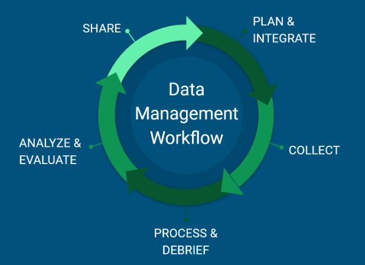

# Data Management Workflow

The figure below describes the general process that PEP uses for managing data, start to finish and cyclically for on-going projects. This workflow consists of eight steps, some of which occur concurrently or similarly timed yet independent of one another.

{fig-align="center"}

## Scope

The PEP Data Management Plan operates in accordance of the scope of the NOAA Data Management Handbook. These lists have been subset to list datasets relevant to PEP.

### Data in Scope

-   Derived data and/or data products

-   Digital audio or video recordings of environmental phenomena

-   Data collected in a laboratory or other controlled environment

-   Model output

-   Third-party data purchased or acquired from external sources that NOAA disseminates or uses in externally facing products or services

-   All legacy data archived in digital form at the NCEI

### Data out of Scope

-   Third-party data purchased or acquired from external sources for internal NOAA access and use only

-   Legacy data that were produced by NOAA Programs, which no longer exist and were never archived

-   Archival information disseminated by NOAA before June 30, 2008

-   Information relating to correspondence with individuals or persons

-   Data labelled as classified, Controlled Unclassified Information (CUI), or restricted

## Plan

(corresponds to "Plan" in the NOAA Data Management Handbook)

Planning is crucial for the success of any project for all components of the work, including future data management. Early data management efforts can pay in dividends later by establishing clear roles, responsibilities, expectations and timelines. Prior to any new data collection, work with S. Koslovsky to:

-   Identify where data will be stored (both short- and long-term; and set up the workspace), what data products will be needed, and what data processing will be required.

-   Create storage locations on network for final data and on Google Drive/elsewhere for intermediate processing; ensure necessary staff have access to these locations.

-   Develop/evaluate/implement data collection strategies that facilitate and simplify data management steps that follow (e.g. datasheets, in-field data entry, in-field archive efforts).

-   Coordinate (or at least communicate) with the AFSC OFIS team regarding network storage space needs and any other concerns.

-   Decide how best to organize the metadata for the project. All metadata entries within InPort will be published publicly and, eventually, used to create standards compliant alongside any open data products. A one-to-one relationship between metadata records and eventual open data products often makes this process easier.

The [NOAA Data Management Planning Procedural Directive](https://nosc.noaa.gov/EDMC/PD.DMP.php) (PD) ([direct link](https://nosc.noaa.gov/EDMC/documents/EDMC-PD-DMP-2.0.1.pdf) to PDF of current version 2.0.1) requires a data management plan to be developed for all environmental data collected by NOAA programs or systems. The PD provides a generic template and guideline for developing a data management plan and a [data management plan repository](https://drive.google.com/drive/u/0/folders/0Bwl6f-PNVtnndG0yOUJ5cGU0RGs) has been established. A common tool for developing data management plans (<https://dmptool.org>) has a template for NOAA. These represent a minimum requirement and, in fact, PEP data management plans will likely be more thorough. All data management plans should be developed in collaboration with the PEP data science lead (Stacie Koslovsky) and established prior to data collection. Work with S. Koslovsky to complete and submit a data management plan (as appropriate).

## Integrate

(not mentioned in the NOAA Data Management Handbook)

For on-going projects, we will incorporate feedback from the previous year's/season's effort to make improvements to the upcoming effort. For new projects, this might include considering lessons learned from other projects.

## Collect

(corresponds to "Obtain" in the NOAA Data Management Handbook)

It is critical to have clear instructions and expectations for how data are collected. It is also important to consider how to handle and/or document deviations from planned data collection – which are bound to happen!

### Field Data Collection

During field data collection, begin preliminary data management, as able:

-   Review datasheets for data recording errors.

-   Scan datasheets for backup.

-   Use temporary storage on external/portable drives, cloud providers, or individual government laptops to backup images, scanned datasheets and other critical files.

-   Enter field data into cloud-based data entry tools.

## Process

(corresponds to "Process" and "Preserve" in the NOAA Data Management Handbook)

After field work is completed, our aim will be to download, process and QA/QC data as soon as possible. All data should be archived to the network no later than **one month** after the completion of the project.

### Raw and Original Data

The details of where data are stored can be found in the [PEP Data Storage](storage.qmd) section of this document.

-   In practice, the transfer of data from field collection storage to the approriate archive location should be the first priority upon returning from the field. Temporary storage of files on external/portable drives, cloud providers, individual government laptops should not exceed 30 days after return from the field.

-   After data are transferred, files and associated information should be reviewed for consistency.

-   In general, 'raw' or 'original' data collected in the field should not be altered.

-   In cases where the data are known to be incorrect or a more correct value is known, those files or entries should be edited.

-   A common occurrence is for files to not be named properly in the field. File names should be corrected at this time.

-   Additionally, data transcription errors can occur, and this is the appropriate time to fix those errors.

### Processed and Final Data

After raw/original data are archived to the approriate archive location, data should be processed and reviewed for outliers. Data entry and QA/QC should be processed and finalized **within three months** of the field effort, so that other efforts (e.g. image review, counting) are able to proceed in a timely manner.

The processing and review steps will vary by project, but generally:

-   We will use automated processes for streamlining and documenting processes whenever possible.

-   Custom data-entry forms and/or spatial processing templates will be created for data entry and processing when needed.

-   Queries and/or other data visualizations will be used to facilitate data QA/QC.

-   Spatial data (grid and other products) will be stored in their native projection in the database.

    -   For many projects, this will be WGS-84.

    -   Spatial data from outside sources (e.g. environmental data) will be stored in the original projection. This may require data to be reprojected for specific analyses or other needs.

## Debrief

(not mentioned in the NOAA Data Management Handbook, but somewhat captured in the "Dispose" section, in consideration of continued needs for how/when/why data are collected, managed and stored)

After fieldwork is completed, part of the larger project debrief should include time for discussing in-field data collection and management. The general comments and any specific actionable changes uncovered during the debrief should be incorporated into the INTEGRATE step in the next cycle of the data management workflow for that project.

## Analyze

(corresponds to "Access" in the NOAA Data Management Handbook)

Part of the data workflow is to ensure the final products are easily usable and accessible for analyses. Accessing data for each analysis will be different; work with S. Koslovsky to identify the most efficient way to extract data from the DB and/or network for your needs.

## Evaluate

(not mentioned in the NOAA Data Management Handbook)

We want to emphasize the feedback loop from analytical processes to data management. Our goal with data management is to streamline processing and extraction of information for analyses. This may be updates/improvements to data management processes over time. Feedback and communication are important for ensuring data products meet current and future analytical needs, and this information should be incorporated into the INTEGRATE step in the next cycle of the data management workflow for any related field projects.

## Share

(corresponds to "Share" in the NOAA Data Management Handbook)

Data are considered final when a project is completed (e.g., ChESS) or when the annual data processing for a project (e.g., harbor seal surveys) is completed. After data are processed and considered final, S. Koslovsky will notify PI and data sharing staff to prepare final datasets for archive and distribution (when appropriate).

### Metadata

NOAA Fisheries requires that all data collected be documented within the official NOAA Fisheries metadata repository, [InPort](https://inport.nmfs.noaa.gov/inport). InPort provides an extensive suite of tools for editing and managing metadata. For PEP projects, we will update InPort as follows:

1.  S. Koslovsky and C. Christman will work with project leads to establish a metadata plan and to get started with InPort.

2.  The project lead will enter the appropriate metadata information into a GoogleForm that will be used to create and maintain program metadata records.

    1.  The responsibility for creating, editing, and maintaining the GoogleForm entries is the responsibility of the project lead. Because these records will be available to the public and, in many cases, represent the authoritative documentation of the data set, project leads should devote an appropriate amount of time and thought to development of metadata records.

    2.  Once the necessary and complete information is entered into the GoogleForm, notify C. Christman.

3.  C. Christman will complete the necessary updates/entries.

For more information on metadata workflow, [review this documentation](https://docs.google.com/document/d/1kmEoKzXjS-O2r-6euBCL7A3We8mfAre3fpcEvytBD84/edit?tab=t.0) and/or contact C. Christman.

### Online Repositories

Much of the data collected and processed as part of PEP research activities is intended for public release, either in compliance with NOAA policies (e.g. Public Access to Research Results \[PARR\]) or in support of best practices related to open science and reproducible research. Keeping track of the evolving policies and expanding tools/repositories available can be challenging. Here, we outline our plan for the use of available repositories.

If you are publishing a manuscript and the journal requires the data to be provided on an open data portal, work with S. Koslovsky to identify the most appropriate repository and to ensure metadata are created.

## Dispose

(added based on information from the NOAA Data Management Handbook)

Disposition of data is based on community needs and the records retention schedule. This does include deletion of information based on the terms of the records retention schedule. Temporary files or data generated for testing are not required to be maintained. Files should be evaluated periodically for deletion.